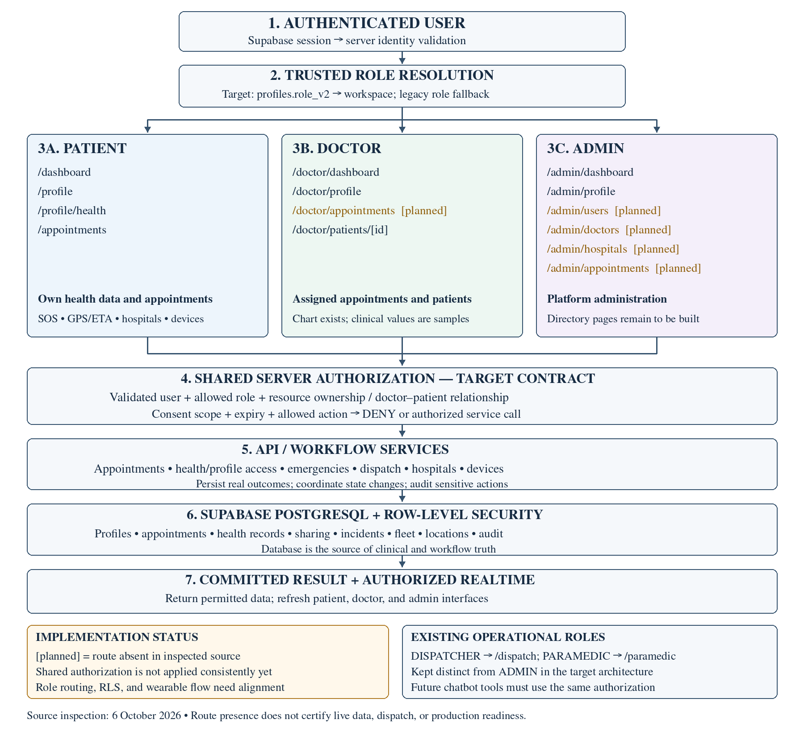

# SOS Healthcare

SOS Healthcare is a Next.js application for patient emergency requests, hospital discovery, health profiles, appointments, and separate clinical and administrative workspaces. Supabase supplies authentication, PostgreSQL storage, row-level security (RLS), and Realtime updates.

> This repository is a development platform, not a verified emergency service. An SOS screen or estimated arrival time does not prove that an ambulance has been dispatched. For immediate help, use your local emergency service.

## Architecture and workflow image




The diagram is organized in six layers, top to bottom: **(1)** identity and session, **(2)** server role resolution, **(3)** role workspaces, **(4)** API handlers, **(5)** Supabase Postgres with RLS, **(6)** live updates and external services. Solid boxes exist in the inspected repository; **dashed** boxes are planned or known gaps. A page being present does not establish that its permissions, integrations, or displayed data are production-ready.

### End-to-end workflow at a glance

| Step | What happens | Where | Status |
| --- | --- | --- | --- |
| 1 | User signs in (email/password or Google); callback exchanges the code for a Supabase session | `/auth/*`, `/auth/callback`, `/api/auth/callback` | Present |
| 2 | Middleware validates the user with `getUser()` on matched page prefixes and redirects to `/auth/login` | `src/middleware.ts` (`/dashboard`, `/profile`, `/emergency`, `/appointments`, `/admin`, `/doctor`, `/dispatch`, `/devices`) | Present; does not cover `/api`, `/paramedic`, `/hospitals`, `/settings` |
| 3 | Server resolves the trusted role: `profiles.role_v2`, then legacy `profiles.role` | `src/lib/authorization.ts` | Present |
| 4 | User is routed to a workspace: patient `/dashboard`, doctor `/doctor/dashboard`, admin `/admin/dashboard`, dispatcher `/dispatch`, paramedic `/paramedic` | `src/app/(main)/dashboard/page.tsx` | **Gap:** reads legacy `role`; sends paramedic/dispatcher to admin |
| 5 | Workspace calls an API handler, which must re-validate identity and authorize ownership, care relationship, consent scope, and expiry | `src/app/api/*` | Partial; only appointments and `authorization.ts` use the shared helper |
| 6 | PostgreSQL RLS applies a second boundary and persists the result | `supabase/schema.sql`, `supabase/migrations/001–003` | Partial; policies and helper disagree (see section 4) |
| 7 | UI reads the committed result; Realtime pushes authorized updates (ambulance position, incident status) | `useRealtime`, `useAmbulancePing`, `AmbulanceTracker` | Present |
| 8 | External calls: Google Maps (hospitals, geocoding), optional Twilio SMS, legacy Fitbit | `src/services/hospitals.ts`, `src/lib/google-maps.ts`, `src/lib/emergency-notifications.ts`, `src/lib/fitbit.ts` | SMS delivery unverified; Fitbit legacy |

#### Role journeys

- **Patient:** sign in → `/dashboard` → profile and health data → book an appointment (`POST /api/appointments`) or trigger SOS (`POST /api/emergencies`) → watch location/ETA (`/emergency/location`).
- **Doctor:** sign in → `/doctor/dashboard` (assigned appointments) → `/doctor/patients/[patientId]` (chart requires an appointment or active, unexpired sharing permission).
- **Admin:** sign in → `/admin/dashboard`; user, doctor, hospital, and appointment management pages are planned.
- **Dispatcher / paramedic:** `/dispatch` assigns and releases ambulances via `/api/dispatch`; `/paramedic` reports position and advances status.

#### SOS lifecycle (target)

`pending → dispatched → en_route → arrived → resolved`, with cancellation handled explicitly and the ambulance released on resolution. The current creation path can return a dispatched-looking response after a failed insert; see section 6.

## 1. System layers and responsibilities

| Layer | Repository location | Responsibility |
| --- | --- | --- |
| User interfaces | `src/app/(main)/`, `src/components/` | Patient app, clinical portal, admin console, shared navigation and footer |
| Browser identity state | `src/contexts/AuthContext.tsx` | Session state, profile display, password signup/login, Google OAuth, signout |
| Authentication middleware | `src/middleware.ts` | Validate identity on matched page routes and redirect unauthenticated visitors to login |
| Server authorization helpers | `src/lib/authorization.ts` | Validate the caller with `getUser()`, resolve the database role, and evaluate doctor–patient relationships |
| API handlers | `src/app/api/` | Handle appointments, emergencies, dispatch, location, contacts, hospitals, and legacy wearable callbacks |
| Database authorization | `supabase/schema.sql`, `supabase/migrations/` | Enforce row access, role constraints, ownership, and persistence |
| Live updates | `src/hooks/useRealtime.ts`, `src/hooks/useAmbulancePing.ts`, `src/components/AmbulanceTracker.tsx` | Subscribe to changes and report ambulance position |
| External services | `src/services/hospitals.ts`, `src/lib/google-maps.ts`, `src/lib/emergency-notifications.ts`, `src/lib/fitbit.ts` | Hospital search, mapping, optional SMS, and legacy Fitbit integration |

**Trust boundary:** browser role checks and hidden buttons are navigation aids. Every protected read or write must be authorized on the server and constrained by RLS. The intended design reuses one authorization evaluator across protected APIs and future AI tools; the current repository does not consistently apply that evaluator to every handler.

## 2. Authenticated user workflow

1. **Sign in.** The user opens `/auth/login` and uses email/password or Google. Signup, email confirmation, and password reset have separate routes under `/auth/`.
2. **Establish the session.** The OAuth callback exchanges the authorization code for a Supabase session. `AuthContext` loads the user and profile for UI display.
3. **Validate protected requests.** Matched page requests pass through middleware. API handlers must independently validate the user; page middleware is not an API authorization boundary.
4. **Resolve the trusted role.** The server helper reads `profiles.role_v2`, falling back to the legacy `profiles.role`, and recognizes `PATIENT`, `DOCTOR`, `ADMIN`, `PARAMEDIC`, and `DISPATCHER`.
5. **Select a workspace.** The requested destinations are `/dashboard`, `/doctor/dashboard`, and `/admin/dashboard` for patient, doctor, and admin respectively. Operational staff retain separate dispatch and paramedic responsibilities.
6. **Authorize the resource.** A role alone is insufficient for patient records: also check ownership or an approved doctor–patient relationship, action, consent, and expiry.
7. **Apply RLS and persist.** PostgreSQL policies provide a second boundary. Return only the permitted data and report write failures honestly.
8. **Refresh the interface.** Read the committed result and use authorized Realtime events where configured. UI state, cached data, and future chat history must never replace the database as the source of clinical truth.

**Current routing gap:** `/dashboard` reads the legacy `profile.role`, while the server helper prefers `role_v2`. It also sends legacy paramedics and dispatchers to the admin dashboard. These behaviors need alignment before the requested role workflow is considered complete.

## 3. Patient app

Patients manage their own information and appointments. Another patient's identifier must never grant access.

| Requested route | Purpose | Current repository status |
| --- | --- | --- |
| `/dashboard` | Overview and entry points to SOS, location/ETA, hospitals, wearables, health data, and appointments | Page exists; uses `AuthenticatedDashboardView` |
| `/profile` | Personal details and emergency contacts | Page exists |
| `/profile/health` | Health measurements, blood group, allergies, conditions, and medication information | Page exists |
| `/appointments` | Book and review the patient's appointments | Page and appointment APIs exist |

### Dashboard features

| Feature | Supporting routes/files | Required behavior and limitation |
| --- | --- | --- |
| One-Tap SOS | `/emergency`, `/api/emergencies` | Obtain location, persist a real incident, then show its confirmed status. Existing fallback responses can report success without persistence; see implementation gaps. |
| Location and ETA | `/emergency/location`, `AmbulanceTracker`, location hooks | Show authorized ambulance position and timestamp. The current 10–20 minute clamp is a display estimate, not a verified arrival commitment. |
| Nearby Hospitals | `/hospitals`, `/hospitals/[id]`, `/api/hospitals` | Find hospitals and open map directions. Verified ICU/ER capacity requires an actual hospital telemetry integration. |
| Smartwatch Integration | `/devices`, legacy Fitbit code | Display actual connection and sync status. Provider migration and secure token storage remain incomplete. |
| Health Data Sharing | `/profile/health`, `health_records`, `health_sharing_permissions` | Keep data patient-specific and enforce consent scope and expiry on every clinical read. |
| Appointments | `/appointments`, `/api/appointments` | Persist doctor, patient, hospital, time, reason, and status; prevent unauthorized changes and conflicting bookings. |

### Appointment request, step by step

1. The patient selects a doctor, specialty, hospital, and start/end time.
2. `POST /api/appointments` validates identity with `getAuthenticatedUser()` and checks required booking fields.
3. The API checks for an existing non-cancelled reservation with the same doctor and start time.
4. It inserts an appointment using the authenticated user ID as `patient_id`.
5. The database unique constraint on `(doctor_id, starts_at)` catches concurrent identical-start bookings; the API returns `409` for that conflict.
6. `GET /api/appointments` filters patient results by `patient_id` and doctor results by `doctor_id`; admin results are subject to admin RLS.
7. `PATCH /api/appointments/[id]` loads the row and checks patient/doctor ownership before updating. Strict role-specific status transitions still need implementation.

The current constraint blocks reuse of an identical start time even for cancelled rows and does not detect all overlapping intervals. Do not describe it as a complete scheduling engine.

## 4. Doctor clinical portal

Doctors see assigned appointments and authorized patient information. They must not gain unrestricted access to the patient directory.

| Requested route | Purpose | Current repository status |
| --- | --- | --- |
| `/doctor/dashboard` | Assigned schedule and links to patient charts | Page exists and calls `/api/appointments` |
| `/doctor/profile` | Practitioner profile | Page exists |
| `/doctor/appointments` | Dedicated assigned appointment workspace | Planned; schedule is currently shown on the dashboard |
| `/doctor/patients/[id]` | Authorized patient chart | Equivalent URL exists; source folder is `[patientId]` |

### Clinical access, step by step

1. Validate the doctor identity and database role on the server.
2. Load the requested patient identifier and check the relevant care relationship.
3. The existing `canDoctorAccessPatient()` helper permits a `PENDING`/`CONFIRMED` appointment or an `ACTIVE`, unexpired sharing permission.
4. Enforce permitted clinical fields and consent scope before retrieving the record.
5. Apply matching RLS predicates and return the minimum required information.
6. Record the sensitive access through a trusted audit mechanism and display data source/time.

Steps 1–6 are the target contract, not a claim of complete implementation. The current patient chart performs a browser-side appointment check and shows hard-coded vitals and allergy text. It does not call `canDoctorAccessPatient()` to fetch a real clinical chart. Migration 002's clinical policies also differ from that helper: some accept any appointment, and the sharing predicate does not enforce expiry or field scope. These boundaries need to agree.

## 5. Admin console

The requested admin workspace manages platform operations across patients, doctors, hospitals, and appointments. Administrative scope must be explicitly enforced per resource; a dashboard does not establish universal database access.

| Requested route | Purpose | Current repository status |
| --- | --- | --- |
| `/admin/dashboard` | Platform overview and operational entry points | Page exists; includes sample summary content |
| `/admin/profile` | Administrator profile | Page exists |
| `/admin/users` | User management and controlled role assignment | Planned |
| `/admin/doctors` | Doctor verification and management | Planned |
| `/admin/hospitals` | Hospital management and integration status | Planned |
| `/admin/appointments` | Platform-wide appointment management | Planned; appointment API contains an admin read branch |

### Administrative action, step by step

1. Validate identity and require the appropriate administrative permission.
2. Validate the requested action and target resource.
3. Read only the data needed for that operation.
4. Apply changes through a trusted backend with appropriate RLS or explicitly scoped elevated access.
5. Record actor, action, target, time, and outcome in an audit trail.
6. Refresh the console from the committed result.

Migration 003 restricts ordinary profile reads to the owner, so an admin user-directory API needs a deliberately authorized backend path. Do not expose a service-role key to the browser or treat it as a substitute for authorization.

## 6. Emergency and ambulance workflow

The repository retains operational roles in addition to the three primary workspaces:

| Role / route | Responsibility |
| --- | --- |
| `DISPATCHER` at `/dispatch` | Review incidents, assign or release ambulances, manage response status |
| `PARAMEDIC` at `/paramedic` | Report position and advance the response |

### Intended persisted lifecycle

1. Patient grants location permission and submits an SOS.
2. Backend validates identity, coordinates, and request; creates a durable `pending` incident.
3. Authorized dispatch selects an available ambulance and commits the assignment safely.
4. Incident advances through `dispatched → en_route → arrived → resolved`, with cancellation handled explicitly.
5. Ambulance position reports update `ambulance_locations` and the vehicle's current position.
6. Authorized patient subscriptions display the assigned vehicle and incident status.
7. Contact notifications use a configured delivery provider, with failures recorded and retried as appropriate.
8. Resolution releases the vehicle and records the final outcome.

### Current implementation boundaries

- `/api/emergencies` attempts nearest-hospital search, ambulance selection, incident insertion, reverse geocoding, and contact notifications. It can manufacture an in-memory `emg_...` object after a failed insert and return a dispatched status. This is not durable dispatch confirmation.
- Migration 003 allows patient incident insertion only as `pending` with no assigned ambulance. Existing creation logic can attempt an assigned/dispatched insert, so API and RLS must be reconciled.
- `/api/dispatch` performs multiple sequential updates with partial rollback handling; it is not a transactional state machine and does not validate every lifecycle edge or every paramedic assignment.
- The PATCH handler is in `/api/emergencies/route.ts`, while its comment describes `/api/emergencies/[id]`. No corresponding dynamic API route appears in the inspected tree; the route contract needs correction.
- `emergency-notifications.ts` logs simulated messages without Twilio credentials. With credentials, it does not verify the HTTP delivery response before returning a sent result. Logging is not proof of contact notification.
- The patient's estimated time is clamped to 10–20 minutes in creation logic. It is not a traffic-aware dispatch guarantee.

## 7. Database architecture

| Table/group | Purpose | Intended access |
| --- | --- | --- |
| `profiles` | Identity display fields, legacy role, `role_v2`, staff vehicle linkage | Own basic profile; privileged role assignment through trusted administration |
| `patient_profiles` | Patient demographic and body measurements | Owner and specifically authorized clinical access |
| `doctor_profiles`, `doctor_availability` | Practitioner directory and consultation schedule | Safe directory reads; controlled practitioner/admin updates |
| `admin_profiles` | Administrator metadata | Authorized administrative access |
| `appointments` | Patient–doctor booking relationship and status | Patient owner, assigned doctor, authorized admin |
| `health_records` | Measurements, conditions, allergies, medications, source and time | Owner and scoped authorized clinical access |
| `health_sharing_permissions` | Patient–doctor sharing state, scope, expiry | Trusted consent creation, revocation, and evaluation |
| `emergencies`, `ambulances` | Incident state and fleet assignment | Incident owner and authorized emergency staff |
| `user_locations`, `ambulance_locations` | Patient and vehicle position history | Resource-specific authorized access |
| `emergency_contacts` | Contact recipients and notification preferences | Owner and authorized notification backend |
| `hospitals` | Local hospital directory | Directory discovery and controlled updates |
| `device_connections` | Connection metadata and sync information | Owner reads safe metadata; trusted backend writes |
| `audit_logs` | Sensitive action evidence | Backend writes and controlled review; ordinary clients have no direct access in migration 003 |

This table describes the desired access contract. Policy coverage, consent enforcement, insert-time role escalation protection, audit emission, and privileged workflows require verification against the deployed database.

## 8. Optional medical chatbot architecture

No medical chatbot, model-serving backend, clinical RAG pipeline, or chat-history routes appear in the inspected source tree. The following is a future integration contract:

1. **Chat and reasoning:** classify intent and decide whether the request needs patient data or an action.
2. **Medical knowledge:** use reviewed clinical reference material for educational responses, with source and version tracking.
3. **Patient data access:** send a structured tool request through the same server authorization boundary as protected UI APIs. A denied request must stop before protected data is retrieved or added to model context.
4. **Safety and actions:** validate workflow state, require appropriate confirmation or human review, persist actions in the clinical backend, and audit the outcome.
5. **Response:** return only authorized information and explain uncertainty. Emergency escalation must remain available independently of the model.

Conversation history is not a clinical record or the authority for appointments, consent, diagnosis, or emergency state. Model selection and deployment remain separate work; no Qwen/Mistral integration is claimed here.

## 9. Repository map

| Location | Contents |
| --- | --- |
| `src/app/(main)/` | Patient, doctor, admin, emergency, hospital, device, dispatch, and paramedic pages |
| `src/app/(legal)/` | `/privacy-policy`, `/terms-of-service`, `/contact` |
| `src/app/auth/` | Login, signup, callbacks, confirmation, and password recovery |
| `src/app/api/` | HTTP API handlers |
| `src/components/` | Dashboard, health cards, booking, maps, trackers, navigation, and footer |
| `src/contexts/`, `src/hooks/` | Browser identity/theme state, location, live data, and pings |
| `src/lib/`, `src/services/`, `src/types/` | Authorization, Supabase clients, service adapters, and type definitions |
| `supabase/` | Base schema and ordered database migrations |
| `scripts/` | Seed data, administration utility, and build helper |
| `public/` | Static assets, manifest, sitemaps, and verification file |
| `docs/architecture/` | README architecture image in PNG and SVG formats |

## 10. Local development

The inspected package uses Next.js 16, React 19, TypeScript 5, Tailwind CSS 4, Supabase JS/SSR clients, and Google Maps integration. Use a Node.js version compatible with the pinned Next.js package.

```bash
git clone https://github.com/saivimenthanvl-ai/sos-healthcare.git
cd sos-healthcare
npm ci
```

Copy `.env.local.example` to `.env.local` and fill in project-specific values.

Windows PowerShell:

```powershell
Copy-Item .env.local.example .env.local
```

macOS/Linux:

```bash
cp .env.local.example .env.local
```

### Environment configuration

| Variable | Purpose |
| --- | --- |
| `NEXT_PUBLIC_SUPABASE_URL` | Supabase project URL |
| `NEXT_PUBLIC_SUPABASE_ANON_KEY` | Browser-safe project key; RLS must enforce data access |
| `SUPABASE_SERVICE_ROLE_KEY` | Optional trusted administrative tooling; server-only, never browser-exposed |
| `NEXT_PUBLIC_GOOGLE_MAPS_API_KEY` | Client mapping and hospital search; restrict permitted origins and APIs |
| `GOOGLE_MAPS_API_KEY` | Optional server geocoding key, with appropriate restrictions |
| `FITBIT_CLIENT_ID`, `FITBIT_CLIENT_SECRET` | Legacy wearable adapter configuration; incomplete after migration 003 |
| `TWILIO_ACCOUNT_SID`, `TWILIO_AUTH_TOKEN`, `TWILIO_PHONE_NUMBER` | Optional SMS variables read by the notification helper; absent from the example env file |

Enable the Maps, geocoding, and Places services used by the repository. Configure Supabase authentication providers, project/site URLs, approved local and deployed callback URLs, and email delivery as applicable. Creating environment variables alone does not verify OAuth or SMS delivery. Keep secrets out of git, screenshots, client bundles, and logs.

### Database setup

Review these files in a development Supabase project before running them:

1. `supabase/schema.sql` — base clinical/operational tables.
2. `supabase/migrations/001_roles_and_dispatch.sql` — legacy roles, dispatch policies, signup trigger, and Realtime publication.
3. `supabase/migrations/002_rbac_appointments_health.sql` — primary workspaces, role extensions, appointments, health, sharing, and audit tables.
4. `supabase/migrations/003_security_hardening.sql` — role separation, stricter operational policies, integrity triggers, and removal of legacy wearable token columns.
5. Optionally run `scripts/seed-hospitals.sql` and `scripts/seed-ambulances.sql` for development data. Seed rows are not live hospital/fleet evidence.

Migration files are not guaranteed to be safely repeatable. Migration 003 creates some policies without dropping them first, adds enum values before using them, and rewrites `role_v2` from legacy roles. Review transaction boundaries and preserve intended doctor/admin assignments before executing it. A SQL file in git does not prove it has been applied to the deployed project.

### Start and validate

```bash
npm run dev
```

```bash
npm run lint
npx tsc --noEmit
npm run build
npm run start
```

These commands are development checks, not clinical validation. This README update documents source inspection; it does not certify a successful production build or live integration test.

## 11. Remaining implementation work

1. Add the missing doctor/admin pages in the requested route map and enforce role access on server entry points.
2. Align browser routing, APIs, and RLS around one trusted role representation; keep operational staff distinct from admin.
3. Make emergency creation fail honestly when persistence fails; reconcile creation/assignment policies and use atomic dispatch updates.
4. Replace chart samples and admin summary placeholders with authorized real data, including source and freshness.
5. Apply the same appointment/consent/expiry/scope predicates to the server helper and database policies; protect role fields on insert as well as update.
6. Validate appointment time ranges, overlapping intervals, doctor eligibility, and permitted status transitions.
7. Replace the legacy wearable callback with a provider adapter using state validation and backend-only encrypted tokens. Migration 003 removes the profile columns that callback still updates. Google Health migration is not implemented in this tree.
8. Verify SMS provider responses, persist notification outcomes, and implement retries without claiming simulated delivery.
9. Add trusted audit emission and test cross-user, cross-role, revoked-consent, and expired-consent denial cases.
10. Validate each deployed workflow with separate patient, doctor, admin, dispatcher, and paramedic accounts before relying on it.

## Documentation scope

The requested patient/doctor/admin architecture and existing operational dispatch modules are documented together. Route presence and implementation gaps were checked against repository source on 7 October 2026. This change replaces the architecture/workflow image and updates the documentation; it does not implement missing routes or repair the application behaviors identified above.
